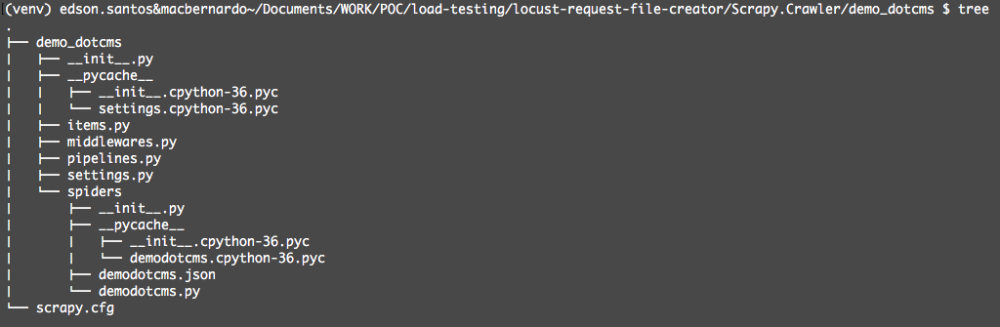

**Scrapy Tool # 1: Scrapy**

https://scrapy.org

virtualenv -p python3 venv 

source venv/bin/activate --> python3

pip install scrapy 

**Case 1 - Crawl html page local dotmcs installation with scrapy spider!**

File 1 

path = ...load-testing/locust-request-file-creator/scrapy/dotcms/spiders/getsite.py

It has been crawled the whole HTML page from my local dotcms pages specifically (.../products and .../resources) and just saved into 2 .html files!

CMD :

scrapy crawl getsite

**Case 2 - Crawl the whole content on local dotmcs installation with scrapy spider!**

File 2

path = ...load-testing/locust-request-file-creator/scrapy/dotcms/spiders/getsite2.py

It has been crawled/extracted the data described in the start_urls session and parsed along with ...dotcms/items.py file using xpath instructions and stored into .CSV or .JSON files.

CMD :

scrapy crawl getsite2 -o dotcms.csv -t csv

scrapy crawl getsite2 -o dotcms.json -t json

where :
-o = output
-t = type

JSON and/or CSV's files.

**Case 3 - Crawl the whole content on demo.dotmcs.com website with scrapy spider!**

File 3

path = ...load-testing/locust-request-file-creator/scrapy/demo_dotcms/demo_dotcms/spiders/demodotcms.py

CMD - (Saving in json file!)

scrapy crawl demodotcms -o demodotcms.json -t json

**Scrapy Tool # 2: BS4(BeautifulSoup4)**

pip install beautifulsoup4

PATH = ...load-testing/locust-request-file-creator/beautifulsoup/collect_links.py

The script 'collect_links.py' has been updated and is using beautifulsoup library to crawl demo.dotcms.com and to save the output to a file. In this case, we are saving to data_dotcms.txt or data_dotcms.py (the same structure).

usage : python collect_links.py <www.demo.dotcms.com> file.txt

**Load Testing tool:** 

https://locust.io

virtualenv -p python3 venv 

source venv/bin/activate --> python3

pip install locustio  

locust -f <locustfile.py> --host http://demo.dotcms.com

The current sctructure is:

path = ...load-testing/locust-request-file-creator/Locust

Locust_Blog (load test and statistics from the blog content)

Locust_Login (load test and statistics simulating login behavior)

Locust_Web (load test and statistics with the main pages of demo.dotcms.com)